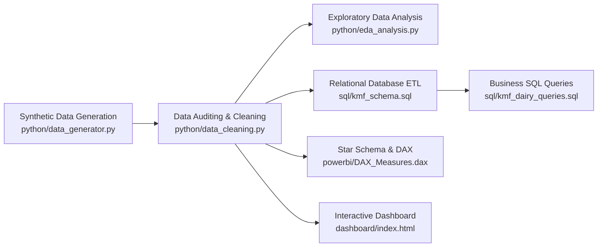

# 🥛 Karnataka Milk Federation (KMF) Dairy Sales & Distribution Analytics

[](LICENSE)
[](https://www.python.org/)
[](sql/)
[](powerbi/)
[](dashboard/)

An end-to-end Data Engineering, Exploratory Data Analysis (EDA), SQL Business Intelligence, and Interactive Analytics Dashboard project modeling the sales, supply chain, and distribution operations of the **Karnataka Milk Federation (KMF - Nandini)** across 10 key Karnataka districts.

---

## 📌 Executive Summary

The **Karnataka Milk Federation (KMF)** is the apex body for dairy cooperatives in Karnataka, marketing dairy products under the household brand name **Nandini**. This project simulates and analyzes enterprise-grade sales transaction data to optimize product distribution, evaluate channel profitability, uncover seasonal trends, and assist regional leadership in data-driven decision-making.

### 🌟 Key Performance Indicators (KPIs)
- **Total Revenue:** ₹11.12 Cr (`₹111,189,799`)
- **Total Volume Distributed:** 1.74 Million Units (`1,736,152 units`)
- **Total Validated Transactions:** `4,982` orders
- **Average Order Value (AOV):** `₹22,318.31`
- **Districts Covered:** 10 Major Karnataka Distribution Hubs
- **Product Portfolio:** 20 Dairy SKUs across 5 Core Categories

---

## 🏗️ Repository Architecture

```text
KMF-Dairy-Analytics/
├── dashboard/                     # Interactive Web Analytics Application
│   ├── assets/                    # High-resolution branding and banner visuals
│   ├── app.js                     # Dashboard interaction logic, charts, filters
│   ├── data.js                    # Embedded analytical dataset for instant offline exploration
│   ├── index.html                 # Modern glassmorphism analytics dashboard
│   └── style.css                  # Custom responsive CSS design system
├── dataset/                       # Data Pipeline Artifacts & Reports
│   ├── cleaning_report.json       # Audit log detailing data cleansing & imputation steps
│   ├── eda_summary.json           # Aggregated statistics and distributions
│   ├── kmf_cleaned_dairy_sales.csv# Fully validated, sanitized sales dataset (4,982 rows)
│   ├── kmf_dairy_sales.csv        # Baseline operational sales dataset
│   ├── kmf_raw_dairy_sales.csv    # Raw synthetic dataset with edge-case anomalies
│   └── sql_results.json           # Output verification records from SQL queries
├── excel/                         # Business Meta-Architecture
│   └── KMF_Data_Dictionary.csv    # Schema attribute definitions, constraints, descriptions
├── powerbi/                       # Enterprise BI Artifacts
│   ├── DAX_Measures.dax           # Advanced DAX expressions (MoM, YoY, YTD, Moving Averages)
│   └── PowerBI_Dashboard_Guide.md # Step-by-step Star Schema modeling & canvas guide
├── python/                        # ETL, Cleansing & EDA Pipeline
│   ├── build_data_js.py           # Automated JSON/JS bundler for web dashboard
│   ├── data_cleaning.py           # Data quality audit, anomaly rectification & normalization
│   ├── data_generator.py          # Realistic transactional synthesizer with seasonality
│   ├── eda_analysis.py            # Deep statistical exploratory data analysis
│   └── verify_sql.py              # Automated SQL execution validator via SQLite engine
├── sql/                           # Database Queries & Analytics
│   ├── kmf_dairy_queries.sql      # 10 Business Intelligence Queries (CTEs, Window Functions)
│   └── kmf_schema.sql             # DDL setup and relational table definitions with indexes
├── visualizations/                # Generated figures and graphical assets
│   ├── kmf_hero_banner.jpg
│   └── kmf_pasture_hero.jpg
├── .gitignore                     # Git ignore rules for Python, IDE, and OS artifacts
├── index.html                     # Root redirect entry point to dashboard
└── README.md                      # Project documentation
```

---

## 🔄 End-to-End Analytics Workflow



### 1. Data Cleaning & Quality Assurance (`python/data_cleaning.py`)
- **Deduplication:** Identified and eliminated 17 duplicate records.
- **Price Anomaly Detection:** Identified negative/corrupted unit prices and reconciled with standard Nandini product catalog pricing.
- **String Standardization:** Handled whitespace padding and casing inconsistencies across distributors and locations.
- **Missing Value Imputation:** Handled missing customer types and payment modes using probability-weighted distributions.
- **Feature Engineering:** Extracted `Month_Name`, `Month_Num`, `Quarter`, and validated financial consistency (`Revenue = Quantity_Sold * Unit_Price`).

### 2. Exploratory Data Analysis (`python/eda_analysis.py`)
- Analyzed distribution skewness across volume, revenue, and customer basket sizes.
- Quantified regional dominance: **Bengaluru (Urban & Rural)** accounts for over 45% of total statewide demand.
- Category analysis: **Milk & Curd** lead in volume throughput; **Ghee, Butter & Sweets (Nandini Mysore Pak, Peda)** dominate margin and revenue contributions.
- Seasonal indexing: Peak demand spikes observed in Q3/Q4 aligned with major Karnataka festivals (Ganesh Chaturthi, Dasara, and Deepavali).

### 3. Business SQL Queries (`sql/kmf_dairy_queries.sql`)
1. **Federation Baseline Metrics:** High-level operational revenue, quantity, and average order value.
2. **Product SKU Contribution:** Revenue contribution percentage and Pareto rankings.
3. **Regional Distribution:** District-level sales performance and volume market share.
4. **Time Series Trend Analysis:** Monthly revenue trajectory and seasonality tracking.
5. **Channel Partner Performance:** Top-tier distributors evaluated by dispatch volume and revenue.
6. **Low-Velocity SKU Audit:** Identification of underperforming or niche product lines.
7. **Basket Size Analysis:** Average quantity per order across dairy categories.
8. **Cumulative Revenue & 3-Month Moving Average:** Window function analysis (`ROWS BETWEEN 2 PRECEDING AND CURRENT ROW`).
9. **Top SKU per Category:** Ranked product revenue using `DENSE_RANK() OVER (PARTITION BY category)`.
10. **Customer Segmentation Profile:** Wholesale vs. Retail vs. Institutional demand share.

### 4. Power BI Modeling (`powerbi/`)
- **Star Schema Architecture:** Fact table `kmf_sales` joined with dynamic calendar dimension `DateTable`.
- **DAX Measures:** Includes `Total Revenue`, `Total Quantity`, `AOV`, `YoY Revenue Growth`, `MoM %`, and `3M Moving Average`.

### 5. Interactive Dashboard (`dashboard/`)
- Built with HTML5, CSS3, and JavaScript featuring modern glassmorphism UI.
- Interactive filter controls for Product Categories, Karnataka Districts, Customer Segments, and Date Ranges.
- Dynamic KPI counters, category distribution breakdown, top distributor rankings, and monthly sales trends.

---

## 🚀 Getting Started

### Prerequisites
- Python 3.10+
- Modern Web Browser (Chrome, Edge, Firefox, Safari)
- Optional: PostgreSQL, MySQL, or SQLite for database execution
- Optional: Microsoft Power BI Desktop for `.pbi` implementation

### 1. Running the Interactive Dashboard
You can run the web dashboard directly without installing external web servers:
```bash
# Clone the repository
git clone https://github.com/anilgb17/KMF-Dairy-Analytics.git
cd KMF-Dairy-Analytics

# Open index.html in your default web browser
# (On Windows)
start index.html

# Or launch using Python's built-in HTTP server:
python -m http.server 8000
# Then visit http://localhost:8000 in your browser
```

### 2. Running Data Processing & Analysis Pipeline
```bash
# Set up virtual environment
python -m venv venv
source venv/bin/activate  # On Windows: venv\Scripts\activate

# Install required dependencies
pip install pandas numpy matplotlib seaborn

# Run data cleaning and validation
python python/data_cleaning.py

# Run Exploratory Data Analysis
python python/eda_analysis.py

# Verify SQL queries against SQLite engine
python python/verify_sql.py
```

### 3. Executing SQL Queries
Import `sql/kmf_schema.sql` and `sql/kmf_dairy_queries.sql` into PostgreSQL, MySQL, or SQLite:
```sql
-- In PostgreSQL / MySQL:
\i sql/kmf_schema.sql
\i sql/kmf_dairy_queries.sql
```

---

## 📊 Dataset Schema Overview

| Field Name | Type | Description |
|:---|:---|:---|
| `sale_id` | INT | Unique transaction identifier |
| `Date` | DATE | Transaction timestamp (YYYY-MM-DD) |
| `Product` | VARCHAR | Nandini dairy product name (e.g., Toned Milk, Special Ghee) |
| `Category` | VARCHAR | Category (Milk, Curd, Ghee & Butter, Sweets, Cheese & Paneer) |
| `Location` | VARCHAR | Karnataka district hub (Bengaluru, Mysuru, Hubballi, etc.) |
| `Distributor` | VARCHAR | Authorized regional cooperative distributor name |
| `Quantity_Sold` | INT | Units or packets dispatched |
| `Unit_Price` | DECIMAL | Price per unit in INR (₹) |
| `Revenue` | DECIMAL | Total transaction value (`Quantity_Sold * Unit_Price`) in INR (₹) |
| `Customer_Type` | VARCHAR | Segment (`Wholesale`, `Retail`, `Institution`) |
| `Payment_Mode` | VARCHAR | Mode (`UPI`, `Net Banking`, `Cash`, `Credit`) |

---

## 👤 Author

**Anil Govind Badiger**  
- GitHub: [@anilgb17](https://github.com/anilgb17)  
- Email: anilbadiger857@gmail.com  
- Degree: Computer Science & Engineering  

---

## 📜 License

This project is licensed under the MIT License - see the [LICENSE](LICENSE) file for details.
